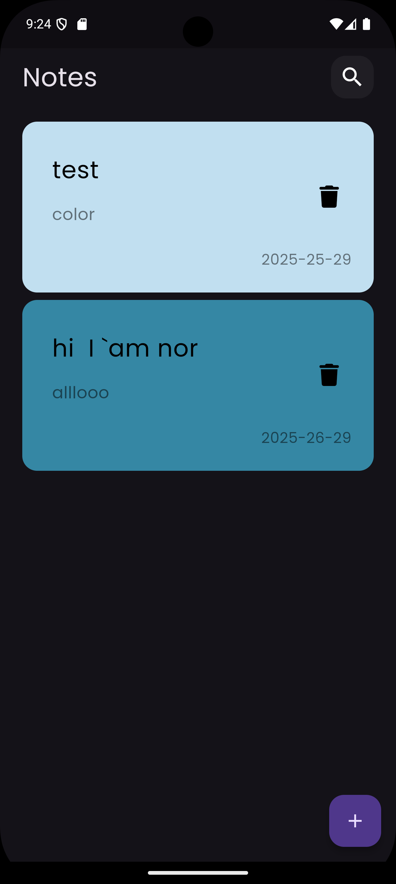
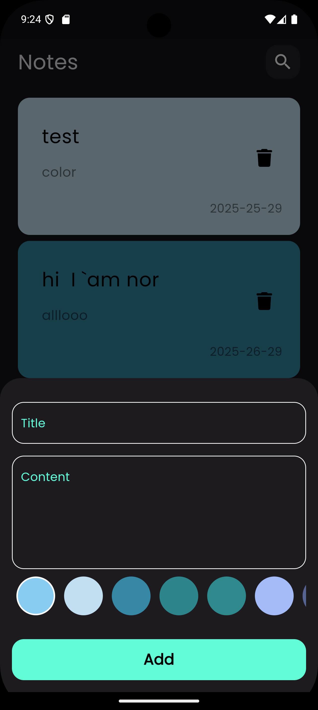
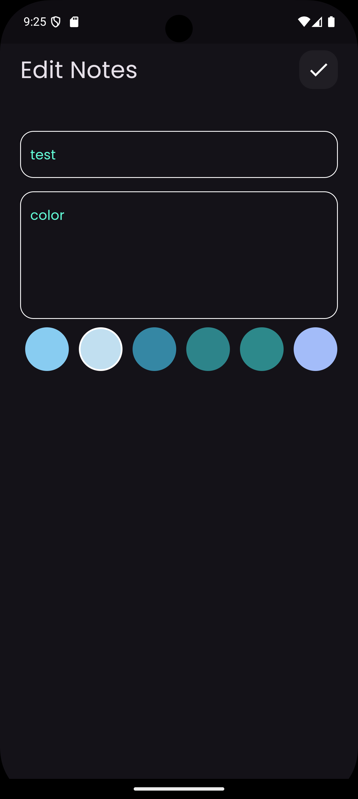

# Flutter Note App 📝


A simple and elegant **Note App** built with Flutter. This app allows users to create, read, update, and delete notes. It uses **Cubit** for state management and **Hive** for fast and efficient local data storage.

---

## Features ✨

- **Create Notes**: Add new notes with a title and description.
- **Read Notes**: View all saved notes in a clean and organized list.
- **Update Notes**: Edit existing notes to update their content.
- **Delete Notes**: Remove notes you no longer need.
- **Local Storage**: Notes are saved locally using **Hive** for offline access.
- **State Management**: Uses **Cubit** to manage app state efficiently.
- **Responsive Design**: Works seamlessly on both mobile and tablet devices.

---

## Screenshots 📱

| Home Screen | Add Note | Edit Note |
|-------------|----------|-----------|
|  |  |  |

---

## Technologies Used 🛠️

- **Flutter**: UI framework for building natively compiled applications.
- **Cubit**: Lightweight state management solution (part of the Bloc library).
- **Hive**: Fast and lightweight NoSQL database for local storage.
- **Dart**: Programming language used for Flutter development.

---

## Getting Started 🚀

Follow these steps to set up and run the project on your local machine.

### Prerequisites

- Flutter SDK installed (version 3.0.0 or higher).
- Android Studio or VS Code with Flutter and Dart plugins installed.


### Installation
1. **Clone the repository**:
   ```bash
   git clone https://github.com/your-username/your-repo-name.git
   cd your-repo-name
2. **flutter pub get**:
      ```bash
     flutter pub get
     flutter run

---
### How to Use the App 🧑‍💻
1. **Add a Note**:

-Tap the "Add Note" button.

-Enter a title and description.

-Save the note.

2. **Edit a Note**:

-Tap on an existing note in the list.

-Update the title or description.

-Save the changes.

3.**Delete a Note**:

-click in the trash icon 

**Contributing 🤝**
-Contributions are welcome! If you'd like to contribute, please follow these steps:

 1.Fork the repository.

2.Create a new branch (git checkout -b feature/YourFeatureName).

3.Commit your changes (git commit -m 'Add some feature').

4.Push to the branch (git push origin feature/YourFeatureName).

5.Open a pull request.
